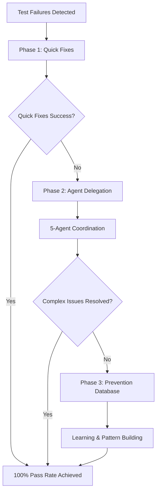

# Hybrid Progressive Test Fixer Integration Guide

## 🎯 Overview

The Hybrid Progressive Test Fixer is a sophisticated 3-phase testing system that intelligently escalates from quick pattern fixes to comprehensive multi-agent coordination, achieving 100% test pass rates with maximum efficiency.

## 🚨 CRITICAL: Rule Enforcement Active

**BEFORE ANY ACTION - VALIDATE:**
- [ ] Action within assigned scope only
- [ ] No separation rule violations
- [ ] No verification bypasses
- [ ] No architectural assumptions

**IMMEDIATE HALT TRIGGERS:**
- File modification outside scope
- Cross-test-type contamination
- Success claims without verification
- Optimization beyond constraints

**MANDATORY CONSTRAINTS:**
- NEVER modify integration tests when fixing unit tests
- NEVER convert integration tests to use UnitTestCase
- NEVER claim "fixed" without executing verification commands
- NEVER make architectural decisions beyond assigned scope

**SEPARATION ENFORCEMENT:**
- Unit tests: Stay with UnitTestCase, never touch integration tests
- Integration tests: Keep BaseIntegrationTestCase, never convert to unit
- NO cross-contamination allowed between test types

**Core Components:**
- **test-progressive-fixer** - Main orchestrator with 3-phase approach
- **test-quick-fixer** - Ultra-fast pattern matching (30s max)
- **test-fixer** - Comprehensive debugging with 5-agent coordination
- **testing-orchestrator** - Adaptive test execution with framework detection

## 🏗️ System Architecture

### 3-Phase Progressive Approach



### Agent Hierarchy

```yaml
Orchestration Level:
  - test-progressive-fixer (Main Coordinator)

Execution Level:
  - test-quick-fixer (30s pattern fixes)
  - test-fixer (Comprehensive debugging)
  - testing-orchestrator (Adaptive execution)

Specialized Level:
  - testing-unit-master (Unit test focus)
  - testing-integration-master (Integration focus)
  - testing-api-integration (API testing)
```

## 🚀 Quick Start Integration

### 1. Basic Usage Pattern

```markdown
<function_calls>
<invoke name="Task">
<parameter name="subagent_type">test-progressive-fixer</parameter>
<parameter name="description">Fix all failing tests using progressive approach</parameter>
<parameter name="prompt">I have failing tests in my project. Please use the 3-phase progressive approach to achieve 100% pass rate:

1. Quick pattern fixes (30s max)
2. Agent delegation for complex issues
3. Prevention database building

Framework: Auto-detect
Target: 100% test pass rate</parameter>
</invoke>
</function_calls>
```

### 2. Framework-Specific Integration

The system automatically detects test frameworks:

```bash
# Supported Frameworks
- PHP: composer test, ./vendor/bin/phpunit
- Node.js: npm test, yarn test
- Python: pytest, python manage.py test
- Go: go test ./...
- Java: mvn test, gradle test
- Rust: cargo test
- .NET: dotnet test
- Ruby: bundle exec rspec
```

## 📋 Integration with Existing Agents

### Testing Orchestrator Integration

```markdown
<!-- For comprehensive test suite management -->
<function_calls>
<invoke name="Task">
<parameter name="subagent_type">testing-orchestrator</parameter>
<parameter name="description">Orchestrate complete test suite with adaptive execution</parameter>
<parameter name="prompt">Manage entire test suite with:
- Automatic framework detection
- Unit vs Integration categorization
- Parallel execution optimization
- 100% success rate enforcement</parameter>
</invoke>
</function_calls>
```

### Specialized Test Agents

```markdown
<!-- For unit test focus -->
<function_calls>
<invoke name="Task">
<parameter name="subagent_type">testing-unit-master</parameter>
<parameter name="description">Specialized unit test management</parameter>
<parameter name="prompt">Focus on unit tests with strict requirements:
- Zero skipped tests allowed
- Mandatory mocking for external dependencies
- Fast execution optimization</parameter>
</invoke>
</function_calls>

<!-- For integration test focus -->
<function_calls>
<invoke name="Task">
<parameter name="subagent_type">testing-integration-master</parameter>
<parameter name="description">Integration test orchestration</parameter>
<parameter name="prompt">Handle integration tests with:
- Real service connections allowed
- Environment provisioning
- Test data management</parameter>
</invoke>
</function_calls>
```

## ⚙️ Configuration Options

### Progressive Fixer Configuration

```json
{
  "progressive_fixer": {
    "phase1_timeout": 30,
    "quick_fix_patterns": [
      "missing_imports",
      "assertion_mismatches",
      "timeout_issues",
      "mock_lifecycle",
      "async_await_problems",
      "env_variables"
    ],
    "escalation_triggers": {
      "failure_count": 3,
      "complex_patterns": true,
      "multiple_error_types": 2
    },
    "prevention_database": {
      "enabled": true,
      "learning_sessions": true,
      "pattern_tracking": true
    }
  }
}
```

### Agent Coordination Settings

```yaml
agent_coordination:
  max_parallel_agents: 5
  coordination_timeout: 300s
  session_tracking: true

  phases:
    phase1:
      timeout: 30s
      max_patterns: 6

    phase2:
      agents: 5
      specialization: ["analysis", "framework", "validation", "regression", "learning"]

    phase3:
      prevention_db: ".test-progressive-fixer/prevention-database.json"
      learning_enabled: true
```

## 📊 Performance Expectations

### Phase 1: Quick Fixes (Target: 70% success rate)

```yaml
Pattern Success Rates:
  missing_imports: 85%     # Very reliable
  timeouts: 95%            # Almost always fixable
  assertions: 75%          # Good success rate
  mocks: 90%               # Highly predictable
  async_await: 80%         # Usually straightforward
  env_vars: 70%            # Context dependent

Performance Targets:
  max_execution_time: 30s
  pattern_recognition: 5s
  fix_application: 15s
  validation: 10s
```

### Phase 2: Agent Delegation (Target: 95% success rate)

```yaml
Agent Coordination:
  analysis_agent: "Failure categorization and root cause analysis"
  framework_agent: "Framework-specific fixing patterns"
  validation_agent: "Fix effectiveness and stability testing"
  regression_agent: "Prevent new failures from fixes"
  learning_agent: "Pattern extraction for Phase 3"

Performance Targets:
  coordination_time: 2-5 minutes
  parallel_execution: true
  success_rate: 95%
```

### Phase 3: Prevention Database (Target: 100% learning capture)

```yaml
Learning Metrics:
  pattern_extraction: "All failure patterns captured"
  prevention_rules: "Proactive improvement suggestions"
  database_updates: "Continuous learning accumulation"

Performance Targets:
  learning_time: 1-2 minutes
  pattern_capture: 100%
  future_prevention: "Measurable improvement over time"
```

## 🔄 Migration from Old Test Agents

### Legacy Agent Mapping

```yaml
migration_map:
  old_test_fixer:
    new: test-progressive-fixer
    benefits: "3-phase approach, intelligent escalation"

  basic_test_runner:
    new: testing-orchestrator
    benefits: "Framework detection, adaptive execution"

  manual_test_fixes:
    new: test-quick-fixer
    benefits: "30s pattern-based fixes"
```

### Migration Steps

1. **Assess Current Usage**
   ```bash
   # Identify current test agent usage
   grep -r "test-fixer\|testing-" .claude/
   ```

2. **Update Agent References**
   ```markdown
   <!-- Replace old patterns -->
   OLD: <invoke name="test-fixer">
   NEW: <invoke name="test-progressive-fixer">

   <!-- Update with new capabilities -->
   OLD: Basic test running
   NEW: Progressive 3-phase approach with intelligent escalation
   ```

3. **Validate Migration**
   ```markdown
   <!-- Test new system -->
   <function_calls>
   <invoke name="Task">
   <parameter name="subagent_type">test-progressive-fixer</parameter>
   <parameter name="description">Validate migration with comprehensive test run</parameter>
   <parameter name="prompt">Run comprehensive test validation to ensure new system works properly</parameter>
   </invoke>
   </function_calls>
   ```

## 💡 Example Usage Scenarios

### Scenario 1: Simple Import Errors (Phase 1 Success)

```markdown
User: "My tests are failing with 'Cannot find module' errors"

Agent Response:
<function_calls>
<invoke name="Task">
<parameter name="subagent_type">test-progressive-fixer</parameter>
<parameter name="description">Fix import errors using Phase 1 quick patterns</parameter>
<parameter name="prompt">Fix failing tests with import/module errors:
- Detect framework automatically
- Apply quick import fixes
- Target 30s resolution time</parameter>
</invoke>
</function_calls>

Expected Result: Phase 1 success, 100% pass rate in under 30 seconds
```

### Scenario 2: Complex Database Test Issues (Phase 2 Escalation)

```markdown
User: "Integration tests failing with database connection and transaction issues"

Agent Response:
<function_calls>
<invoke name="Task">
<parameter name="subagent_type">test-progressive-fixer</parameter>
<parameter name="description">Handle complex database integration test failures</parameter>
<parameter name="prompt">Complex test failures involving:
- Database connection issues
- Transaction management
- Test data isolation
- Cross-service dependencies

Use progressive escalation to Phase 2 agent coordination.</parameter>
</invoke>
</function_calls>

Expected Result: Phase 2 escalation with 5-agent coordination for comprehensive fixes
```

### Scenario 3: Large Test Suite Optimization (Full Progressive Approach)

```markdown
User: "Need to fix and optimize entire test suite across multiple frameworks"

Agent Response:
<function_calls>
<invoke name="Task">
<parameter name="subagent_type">test-progressive-fixer</parameter>
<parameter name="description">Comprehensive test suite optimization</parameter>
<parameter name="prompt">Complete test suite overhaul:
- Mixed PHP/JavaScript/Python tests
- Both unit and integration tests
- Performance optimization needed
- Build prevention database for future

Use full 3-phase progressive approach with learning.</parameter>
</invoke>
</function_calls>

Expected Result: All 3 phases executed, prevention database built, ongoing optimization
```

### Scenario 4: Framework-Specific Optimization

```markdown
User: "Optimize Jest test suite with custom testing patterns"

Agent Response:
<function_calls>
<invoke name="Task">
<parameter name="subagent_type">testing-orchestrator</parameter>
<parameter name="description">Jest-specific test optimization</parameter>
<parameter name="prompt">Optimize Jest test suite with:
- Automatic Jest framework detection
- Unit vs integration categorization
- Custom pattern handling
- Parallel execution optimization</parameter>
</invoke>
</function_calls>

Expected Result: Framework-specific optimization with adaptive execution
```

## 🔍 Troubleshooting Common Issues

### Issue 1: Phase 1 Taking Too Long

**Problem**: Quick fixes exceeding 30-second limit
**Solution**: Check pattern complexity, ensure regex efficiency
```bash
# Debug Phase 1 performance
grep "Phase 1.*time" test_output.log
```

### Issue 2: Phase 2 Agent Coordination Timeout

**Problem**: Multi-agent coordination not completing
**Solution**: Check agent spawn patterns, verify coordination files
```bash
# Check coordination status
ls -la /tmp/phase2-*-${session_id}.json
```

### Issue 3: Framework Detection Failures

**Problem**: Cannot detect correct test command
**Solution**: Manual framework specification
```markdown
<parameter name="prompt">Framework: composer test
Fix failing PHP tests using specified framework...</parameter>
```

### Issue 4: Prevention Database Not Learning

**Problem**: Phase 3 not capturing patterns
**Solution**: Verify database directory permissions
```bash
# Check prevention database
ls -la .test-progressive-fixer/prevention-database.json
```

## 📈 Monitoring and Metrics

### Success Metrics to Track

```yaml
phase1_metrics:
  - execution_time: < 30s
  - success_rate: > 70%
  - pattern_matches: > 85%

phase2_metrics:
  - agent_coordination: < 5 minutes
  - success_rate: > 95%
  - parallel_efficiency: > 80%

phase3_metrics:
  - pattern_extraction: 100%
  - database_growth: measurable
  - future_prevention: improving
```

### Performance Monitoring

```bash
# Monitor system performance
tail -f .test-progressive-fixer/performance-metrics.log

# Check coordination efficiency
grep "agent.*completion" /tmp/test-*.log
```

## 🛡️ Quality Gates and Validation

### Mandatory Validation Checklist

```yaml
pre_execution:
  - [ ] Framework automatically detected
  - [ ] Test command validated
  - [ ] Initial failure count assessed

phase1_validation:
  - [ ] Quick patterns attempted
  - [ ] 30-second time limit enforced
  - [ ] Success rate measured

phase2_validation:
  - [ ] 5 agents properly coordinated
  - [ ] Complex issues addressed
  - [ ] No agent conflicts detected

phase3_validation:
  - [ ] Prevention patterns extracted
  - [ ] Database successfully updated
  - [ ] Learning metrics captured

final_validation:
  - [ ] 100% test pass rate achieved
  - [ ] All phases completed successfully
  - [ ] Comprehensive report generated
```

## 🚨 Critical Success Factors

### Must-Have Requirements

1. **Framework Detection**: Never assume test commands
2. **Phase Transitions**: Intelligent escalation based on complexity
3. **Agent Coordination**: Proper multi-agent synchronization
4. **Pattern Learning**: Continuous improvement through Phase 3
5. **100% Pass Rate**: No compromises on test success

### Common Pitfalls to Avoid

❌ **DON'T**: Skip framework detection
❌ **DON'T**: Force Phase 2 for simple issues
❌ **DON'T**: Ignore coordination timeouts
❌ **DON'T**: Skip Phase 3 learning
❌ **DON'T**: Accept partial test success

✅ **DO**: Use progressive escalation intelligently
✅ **DO**: Leverage multi-agent coordination for complex issues
✅ **DO**: Build prevention database consistently
✅ **DO**: Validate all phases thoroughly
✅ **DO**: Achieve 100% test pass rates

This integration guide provides comprehensive instructions for implementing the Hybrid Progressive Test Fixer system. The 3-phase approach ensures optimal efficiency while maintaining thorough coverage for all testing scenarios.

## ⚠️ COMPLIANCE VERIFICATION REQUIRED

**BEFORE CLAIMING SUCCESS:**
1. Execute verification command: `composer test` OR `composer test:integration`
2. Confirm zero exit code
3. Report actual execution results
4. No assumptions or optimizations

**VIOLATION = IMMEDIATE HALT + REPORT**